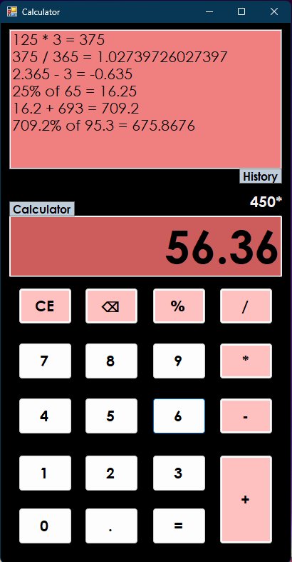

<!-- # Calculator

A simple calculator application built using Windows Forms in C#. This calculator supports basic arithmetic operations such as addition, subtraction, multiplication, division, and percentage calculations. It also maintains a history of computations.

## Features

- Basic arithmetic operations: addition, subtraction, multiplication, division
- Percentage calculations
- Clear and delete functionalities
- Maintains a history of computations

## Getting Started

### Prerequisites

- Visual Studio 2022
- .NET Framework 4.7.2

### Installation

1. Clone the repository: 
```git clone https://github.com/yourusername/calculator.git```
2. Open the solution file `Calculator.sln` in Visual Studio 2022.

### Running the Application

1. Run the already builded release from ```Calculator\bin\Release\Calculator.exe```

## Usage

- **Number Buttons (0-9)**: Click to input numbers.
- **Operator Buttons (+, -, *, /)**: Click to perform arithmetic operations.
- **Equals Button (=)**: Click to compute the result of the operation.
- **Clear Button (C)**: Click to clear the current input and reset the calculator.
- **Delete Button (DEL)**: Click to remove the last character from the current input.
- **Decimal Point Button (.)**: Click to add a decimal point to the current input.
- **Percentage Button (%)**: Click to calculate the percentage.

## View Project



### History

- The application maintains a history of computations, which is displayed in a `ListBox` named `History`.

## Contributing

Contributions are welcome! Please fork the repository and submit a pull request for any improvements or bug fixes.

## License

This project is licensed under the MIT License. See the [LICENSE](LICENSE) file for details. -->


# Calculator


A simple calculator application built using Windows Forms in C#. This calculator supports basic arithmetic operations such as addition, subtraction, multiplication, division, and percentage calculations. It also maintains a history of computations.

## Features
- **Basic Arithmetic Operations:** Supports addition, subtraction, multiplication, and division.
- **Percentage Calculation:** Quickly calculate percentages with the `%` button.
- **History:** Keeps track of previous computations.
- **Clear and Delete Features:** Reset inputs or remove the last character.
- **User-Friendly Interface:** Intuitive layout with clear labels and buttons.

## Getting Started

### Prerequisites
- Visual Studio 2022
- .NET Framework 4.7.2

### Installation
1. Clone the repository: 
   ```bash
   git clone https://github.com/ivakalol/Calculator
   ```
2. Open the solution file `Calculator.sln` in Visual Studio 2022.

### Running the Application
1. Navigate to the `Calculator/bin/Release/` directory.
2. Double-click `Calculator.exe` to launch the application.
3. Ensure that the required `.NET Framework` version is installed on your system.

## Usage
- **Number Buttons (0-9):** Click to input numbers.
- **Operator Buttons (+, -, *, /):** Click to perform arithmetic operations.
- **Equals Button (=):** Compute the result of the operation.
- **Clear Button (C):** Reset the current input and history.
- **Delete Button (DEL):** Remove the last character from the input.
- **Percentage Button (%):** Calculate the percentage.

## View Project


## Contributing
Contributions are welcome! Follow these steps:
1. Fork the repository.
2. Clone your fork:
   ```bash
   git clone https://github.com/ivakalol/Calculator
   ```
3. Create a branch for your feature:
   ```bash
   git checkout -b feature/your-feature-name
   ```
4. Make your changes and commit:
   ```bash
   git commit -m "Add feature"
   ```
5. Push your changes:
   ```bash
   git push origin feature/your-feature-name
   ```
6. Open a pull request.

## Future Plans
- Add support for scientific calculations.
- Modernize the user interface.
- Add unit tests.
